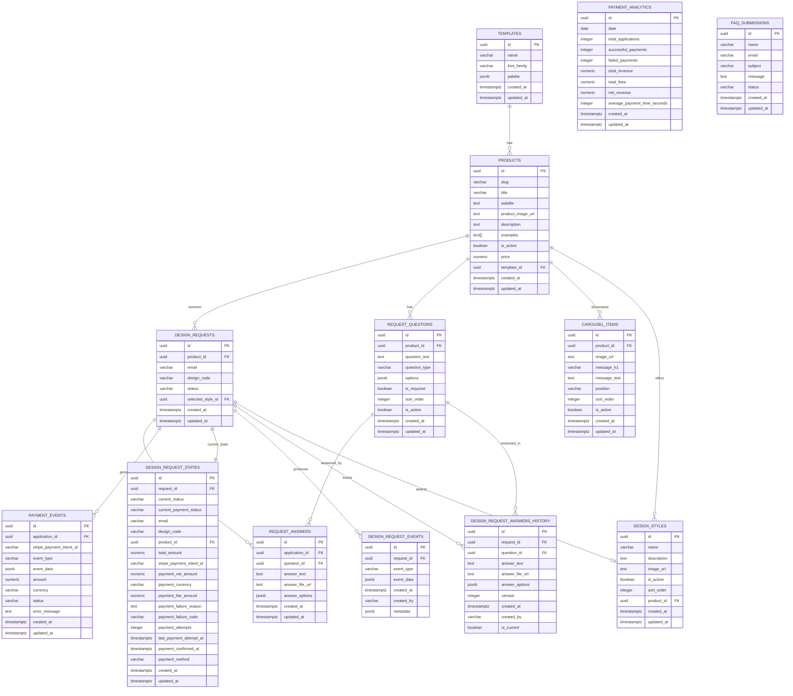

# TheStickest MVP Database - Mermaid ERD

## Entity Relationship Diagram

## Database Schema Overview

### Core Business Flow
1. **TEMPLATES** define design patterns for **PRODUCTS**
2. **PRODUCTS** have dynamic **REQUEST_QUESTIONS** for customization
3. **DESIGN_REQUESTS** capture customer orders with **REQUEST_ANSWERS**
4. **PAYMENT_EVENTS** track Stripe transactions
5. **DESIGN_REQUEST_STATES** provide current status views
6. **DESIGN_REQUEST_EVENTS** maintain immutable audit trail

### Key Design Patterns
- **Event Sourcing**: DESIGN_REQUEST_EVENTS + DESIGN_REQUEST_STATES
- **CQRS**: Separate read/write models for performance
- **Audit Trail**: Complete history tracking with versioning
- **Dynamic Forms**: Configurable questions per product

### Data Governance
- **Row Level Security (RLS)**: Enabled on all tables
- **Foreign Key Constraints**: Enforce referential integrity
- **Audit Fields**: Standard timestamps and user tracking
- **Unique Constraints**: Prevent duplicate design codes and dates

---

*This Mermaid ERD visualizes the complete thestickest-mvp database schema with all entities, attributes, and relationships.*
